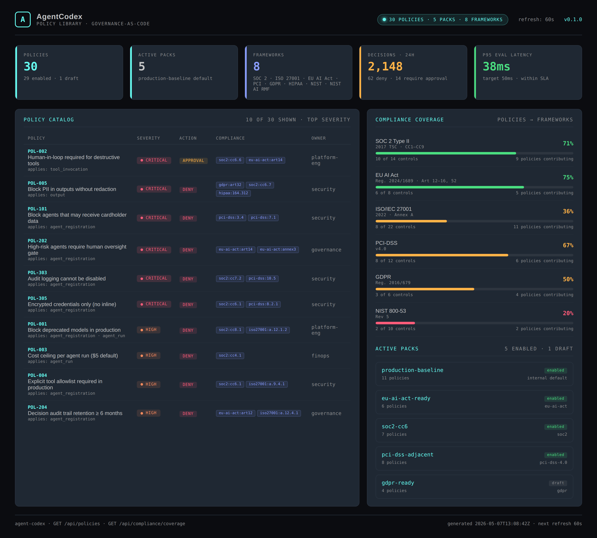
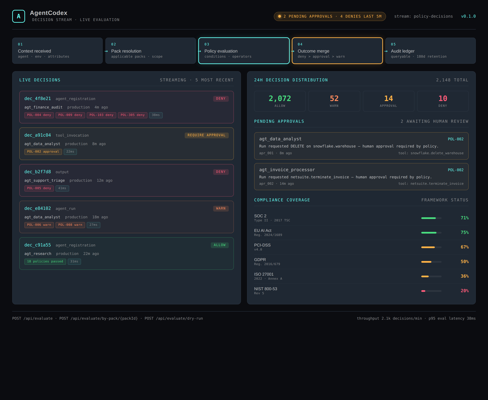
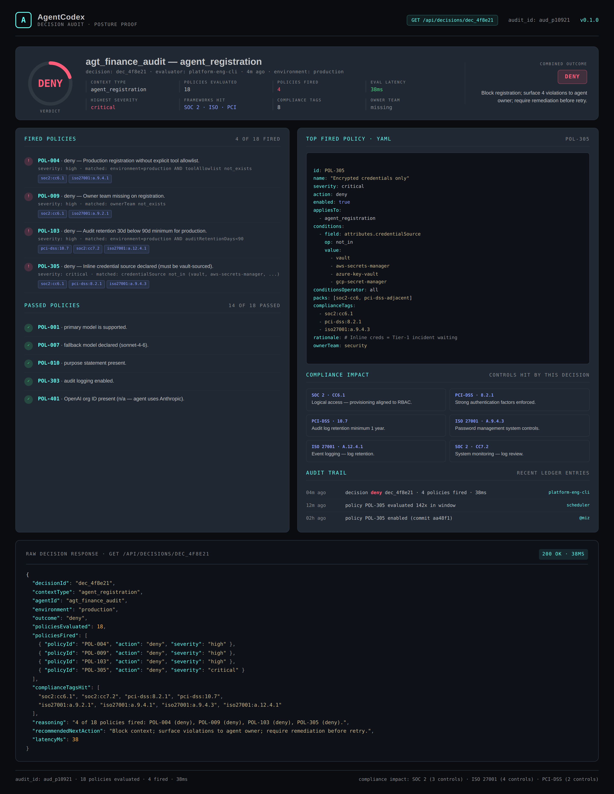

# AgentCodex

[](https://github.com/mizcausevic-dev/agent-codex/actions/workflows/ci.yml)
[](https://nodejs.org)
[](https://www.typescriptlang.org)
[](LICENSE)

> Governance-as-code policy engine for AI platforms — define policies in YAML, map them to compliance standards, evaluate decisions at runtime, and produce audit-ready ledgers.

**Recruiter takeaway:** the control plane between MCP Sentinel (tool surface) and AgentObserve (runtime) — codifies *under what conditions* an AI platform is allowed to operate, with cross-walks to SOC 2, EU AI Act, ISO 27001, PCI-DSS, GDPR, HIPAA, and NIST.

## Project Overview

| | |
|---|---|
| **Domain** | AI Governance · Policy-as-Code · Compliance |
| **Audience** | Director-of-Platform · CISO · Head of AI Governance · Compliance |
| **Core artifact** | TypeScript/Express service exposing 14 endpoints, a 30-policy library, and 8-framework compliance crosswalk |
| **Stack** | Node 20 · TypeScript 5.6 · Express 5 · Zod · Helmet · Swagger UI · Node test runner |
| **Status** | Reference implementation · seeded with realistic policy library and audit fixtures |

## Executive Summary

AgentCodex addresses the gap between *what an AI platform technically allows* and *what an enterprise legally and contractually permits*. Most AI platform teams ship tool-call infrastructure first and bolt governance on later — usually in spreadsheets, ticketing tools, or runbook prose. By the time SOC 2, EU AI Act, or PCI auditors arrive, the platform team is reconstructing intent from logs. AgentCodex inverts that order: governance is declared as versioned, evaluable, replayable code, and every decision is emitted to an audit ledger with explicit compliance tags.

This is the third piece of an **AI Platform Engineering trilogy** — the control plane between [`mcp-sentinel`](https://github.com/mizcausevic-dev/mcp-sentinel) (governs the tool surface) and [`agentobserve`](https://github.com/mizcausevic-dev/agentobserve) (governs the runtime). Sentinel decides *what is allowed to run*, AgentObserve records *what actually happened*, and AgentCodex sits between them deciding *under what conditions an action proceeds, gets warned, requires human approval, or is blocked outright* — and produces the cross-walk to the standard a regulator or auditor will actually ask about. The repo is a credibility artifact built on an enterprise platform background (IBM, CyberArk, Alteryx) showing director-shaped fluency: policy authoring, dry-run blast-radius analysis, framework-by-framework coverage reporting, and an immutable decision audit trail.

## Architecture

```
┌────────────────────────────────────────────────────────────────────┐
│                      Evaluation Surface                            │
│                                                                    │
│  agent_registration    agent_run    tool_invocation    output      │
│         │                  │              │              │         │
│         └──────────────────┴──────────────┴──────────────┘         │
│                              │                                     │
│                              ▼                                     │
│                  POST /api/evaluate                                │
└────────────────────────────────┬───────────────────────────────────┘
                                 │
                                 ▼
┌────────────────────────────────────────────────────────────────────┐
│                       Policy Engine                                │
│                                                                    │
│   1. Pack resolution      ─▶  applicable policies for context      │
│   2. Condition evaluation ─▶  11 operators · nested attributes     │
│   3. Outcome merge        ─▶  deny ▶ approval ▶ warn ▶ allow       │
│   4. Compliance mapping   ─▶  policies → SOC 2 / EU AI Act / ISO   │
│   5. Audit ledger         ─▶  immutable · 180d retention · queryable
└────────────────────────────────┬───────────────────────────────────┘
                                 │
                                 ▼
┌────────────────────────────────────────────────────────────────────┐
│               Decision · Approval · Compliance Report              │
└────────────────────────────────────────────────────────────────────┘
```

AgentCodex expects to consume agent and run metadata from `mcp-sentinel` (registered MCP servers + tool inventory) and `agentobserve` (runtime events + cost/latency telemetry). For this reference implementation those upstreams are mocked through fixtures so the engine can be exercised standalone.

## Governance Workflow

1. **Author policies in declarative form.** Each policy is a typed object with conditions, an action (`allow` / `warn` / `deny` / `require_approval`), severity, owner team, and one or more compliance tags.
2. **Bundle into packs.** Policies are grouped into named packs: `production-baseline`, `pci-dss-adjacent`, `eu-ai-act-ready`, `soc2-cc6`, `openai-enterprise`, `gdpr-ready`.
3. **Evaluate against a context.** A context describes a single decision point — an agent registration, an agent run, a tool invocation, or an output emission. The engine walks every applicable enabled policy and produces a structured decision.
4. **Merge outcomes deterministically.** When multiple policies fire, severity is combined under the precedence `deny > require_approval > warn > allow`.
5. **Emit to audit ledger.** Every decision is recorded with the policies that fired, the compliance tags hit, latency, evaluator, and reasoning — queryable by auditors for the configured retention window.
6. **Dry-run candidate changes.** Before enabling a new or modified policy, replay it against historic decisions to estimate blast radius (`POST /api/evaluate/dry-run`).

## Validation Model

### Policy evaluation

The engine supports 11 condition operators — `eq`, `neq`, `in`, `not_in`, `gt`, `gte`, `lt`, `lte`, `matches` (regex), `exists`, `not_exists` — over both top-level fields and nested attribute paths (e.g. `attributes.toolName`). Conditions combine with either `all` (logical AND) or `any` (logical OR) operators. Policies declare `appliesTo` so they only fire on the relevant decision points.

### Compliance mapping

Eight frameworks are tracked: **SOC 2 Type II**, **ISO/IEC 27001:2022**, **EU AI Act**, **PCI-DSS 4.0**, **GDPR**, **HIPAA Security Rule**, **NIST 800-53 Rev 5**, and **NIST AI RMF 1.0**. Every policy carries a list of `complianceTags` in the form `framework:control` (e.g. `soc2:cc6.1`, `eu-ai-act:art14`, `pci-dss:8.2.1`). The mapper computes per-framework coverage as `controls covered ÷ controls tracked` and surfaces the contributing policies plus the uncovered controls so engineering knows exactly where the gaps are.

### Dry-run blast radius

Before enabling a candidate policy, the dry-run endpoint replays it against the recorded decision history and projects how many historic contexts would have flipped from `allow` to `deny`, `warn`, or `require_approval` — surfacing the exact agents impacted before any production traffic is affected.

### Decision audit ledger

Every evaluation emits a decision record: id, context, outcome, policies fired, compliance tags hit, latency, reasoning, recommended next action, evaluator. The ledger is queryable by outcome, agent, or time window.

## API Endpoints

| Method | Path | Purpose |
|---|---|---|
| GET | `/health` | Service health |
| GET | `/api/policies` | List policies (filter by `pack`, `severity`) |
| GET | `/api/policies/:id` | Fetch one policy |
| GET | `/api/packs` | List policy packs |
| GET | `/api/packs/:id` | Fetch pack with member policies |
| GET | `/api/decisions` | List recent decisions (filter by `outcome`, `agentId`) |
| GET | `/api/decisions/:id` | Fetch one decision with hydrated fired policies |
| GET | `/api/approvals` | List pending human approvals |
| GET | `/api/compliance/coverage` | Per-framework coverage report |
| GET | `/api/compliance/frameworks` | List supported frameworks |
| GET | `/api/dashboard/summary` | Operations summary view |
| POST | `/api/evaluate` | Evaluate a context against all enabled policies |
| POST | `/api/evaluate/by-pack/:packId` | Evaluate against a single pack |
| POST | `/api/evaluate/dry-run` | Replay a candidate policy against historic decisions |
| GET | `/docs` | Swagger UI |

## Sample Validation Request

```http
POST /api/evaluate HTTP/1.1
Content-Type: application/json

{
  "contextType": "agent_registration",
  "agentId": "agt_finance_audit",
  "environment": "production",
  "primaryModel": "claude-opus-4-7",
  "fallbackModel": "claude-sonnet-4-6",
  "declaredPurpose": "Quarterly invoice anomaly detection for finance team",
  "riskClassification": "high",
  "attributes": {
    "auditRetentionDays": 30,
    "auditLoggingEnabled": true,
    "credentialSource": "inline",
    "humanOversightMechanism": null
  }
}
```

## Sample Validation Response

```json
{
  "decisionId": "dec_4f8e21",
  "contextType": "agent_registration",
  "agentId": "agt_finance_audit",
  "environment": "production",
  "outcome": "deny",
  "policiesEvaluated": 18,
  "policiesFired": [
    { "policyId": "POL-004", "action": "deny", "severity": "high",
      "policyName": "Explicit tool allowlist required in production" },
    { "policyId": "POL-009", "action": "deny", "severity": "high",
      "policyName": "Owner team required on every agent registration" },
    { "policyId": "POL-103", "action": "deny", "severity": "high",
      "policyName": "Audit log retention 90 days minimum" },
    { "policyId": "POL-305", "action": "deny", "severity": "critical",
      "policyName": "Encrypted credentials only" }
  ],
  "complianceTagsHit": [
    "soc2:cc6.1", "soc2:cc7.2",
    "pci-dss:8.2.1", "pci-dss:10.7",
    "iso27001:a.9.2.1", "iso27001:a.9.4.1",
    "iso27001:a.9.4.3", "iso27001:a.12.4.1"
  ],
  "reasoning": "4 of 18 policies fired: POL-004 (deny), POL-009 (deny), POL-103 (deny), POL-305 (deny).",
  "recommendedNextAction": "Block context; surface violations to agent owner; require remediation before retry.",
  "latencyMs": 38,
  "evaluatedAt": "2026-05-07T13:08:42Z"
}
```

## Screenshots

### Policy Library — 30 policies, 5 packs, 8 frameworks



### Live Decision Stream — pipeline, distribution, approvals, framework coverage



### Decision Audit Proof — single deny decision with policy YAML and compliance impact



## Getting Started

```bash
git clone https://github.com/mizcausevic-dev/agent-codex
cd agent-codex
npm install
cp .env.example .env
npm run dev
```

The service listens on `http://localhost:3002`. Swagger UI is at `/docs`.

```bash
# Smoke check

[](https://github.com/mizcausevic-dev/agent-codex/actions/workflows/ci.yml)
[](https://nodejs.org)
[](https://www.typescriptlang.org)
[](LICENSE)
curl http://localhost:3002/health

# List the catalog

[](https://github.com/mizcausevic-dev/agent-codex/actions/workflows/ci.yml)
[](https://nodejs.org)
[](https://www.typescriptlang.org)
[](LICENSE)
curl http://localhost:3002/api/policies | jq

# Evaluate a registration

[](https://github.com/mizcausevic-dev/agent-codex/actions/workflows/ci.yml)
[](https://nodejs.org)
[](https://www.typescriptlang.org)
[](LICENSE)
curl -X POST http://localhost:3002/api/evaluate \
  -H 'Content-Type: application/json' \
  -d @docs/sample-context.json | jq

# Run the test suite

[](https://github.com/mizcausevic-dev/agent-codex/actions/workflows/ci.yml)
[](https://nodejs.org)
[](https://www.typescriptlang.org)
[](LICENSE)
npm test
```

## What This Demonstrates

- **Director-shaped governance fluency.** Policy authoring, pack composition, dry-run blast radius, and decision auditing — the four primitives a director-of-platform / CISO partner is actually buying.
- **Compliance literacy.** SOC 2 Type II, EU AI Act, ISO 27001:2022, PCI-DSS 4.0, GDPR, HIPAA, NIST 800-53, NIST AI RMF — eight frameworks crosswalked with control-level granularity.
- **Production-shaped engineering.** Strict TypeScript, Zod-validated contracts, deterministic outcome merging, and a queryable audit ledger.
- **Coherent platform thesis.** Reads as a control plane that integrates with `mcp-sentinel` (tool registry) and `agentobserve` (runtime telemetry), not a one-off.

## Future Enhancements

- Persistence layer (Postgres + audit ledger sealed via append-only WAL)
- YAML loader so policies can live as `.policy.yaml` files in a Git repo
- OPA / Cedar export for shops already on those engines
- Policy versioning + rollback with diff view
- Auth integration (OIDC / SAML) for approval queue
- Policy simulator: replay a window of historic contexts under a candidate pack
- Webhook outbound on `deny` / `require_approval` to PagerDuty / Slack
- Compliance evidence pack export — audit-shaped PDF per framework
- Native ingest from `mcp-sentinel` registrations and `agentobserve` runs

## Tech Stack

- **Runtime:** Node.js 20+, TypeScript 5.6
- **Framework:** Express 5
- **Validation:** Zod 3
- **Security:** Helmet · CORS
- **Logging:** Morgan
- **Docs:** OpenAPI 3.0 via swagger-ui-express
- **Testing:** Node built-in test runner + Supertest

## Portfolio Links

The AI Platform Engineering trilogy:

- [`mcp-sentinel`](https://github.com/mizcausevic-dev/mcp-sentinel) — *what's allowed to run* — MCP server governance and prompt-injection scanning.
- **`agent-codex`** *(this repo)* — *under what conditions* — governance-as-code engine with cross-framework compliance mapping.
- [`agentobserve`](https://github.com/mizcausevic-dev/agentobserve) — *what actually happened* — agent fleet observability with runs, traces, cost, and SLA monitoring.

Together: tool surface · control plane · runtime telemetry. Three pinned repos that read as a single, coherent platform — not three side projects.

## License

MIT — see [`LICENSE`](LICENSE)

---

*Built by [Mirza Causevic](https://github.com/mizcausevic-dev) — Director of Web Engineering · Platform Architecture · AI Governance · 30 yrs (IBM · CyberArk · Alteryx · Digital.ai · Gryphon.ai). Boston, MA.*
