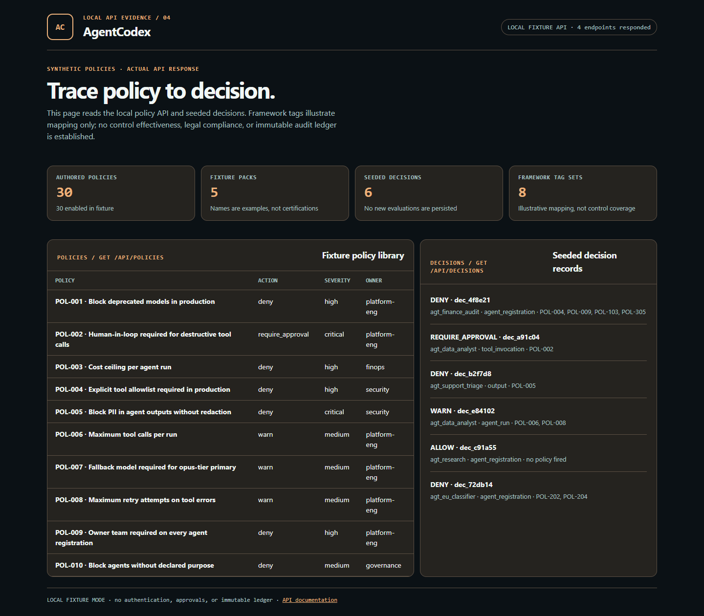

# AgentCodex

[](https://github.com/mizcausevic-dev/agent-codex/actions/workflows/ci.yml)

Local policy-evaluation reference API for AI agent contexts. It evaluates typed TypeScript policy fixtures, combines their outcomes, and shows example compliance-tag coverage.

**Release boundary:** this is a fixture-backed simulator. It has no authentication, tenancy, policy loader, approval workflow, persistent decision log, retention guarantee, or immutable audit trail. It does not establish legal or framework conformance. The demo binds to `127.0.0.1`; `NODE_ENV=production` rejects startup and imports of the app or route modules. Do not submit real decisions or personal data.

## What it does

- Evaluates agent registration, run, tool invocation, and output contexts against 30 seeded policies in six packs.
- Combines matching policy actions by precedence: `deny` > `require_approval` > `warn` > `allow`.
- Lists six seeded decisions and example approval records. New `POST /api/evaluate` responses are **not** appended to those fixtures.
- Counts policy tags for eight named frameworks. Tag presence is not evidence that a control is implemented or operating.
- Replays a candidate policy against synthetic attributes derived from seeded decisions. `/api/evaluate/dry-run` is illustrative, not a measurement of real blast radius; caller-provided regex conditions are rejected.

Policies live in `src/data/policies.ts` and evaluation logic lives in `src/engine/policy-engine.ts`. There is no YAML parser or external policy store.

## API

| Method | Endpoint | Purpose |
| --- | --- | --- |
| GET | `/health` | Local process status |
| GET | `/api/policies`, `/api/policies/:id` | Seeded policy library |
| GET | `/api/packs`, `/api/packs/:id` | Seeded packs |
| GET | `/api/decisions`, `/api/decisions/:id` | Seeded decisions |
| GET | `/api/approvals` | Seeded approval examples |
| GET | `/api/compliance/frameworks`, `/api/compliance/coverage` | Framework names and tag counts |
| GET | `/api/dashboard/summary` | Fixture summary |
| POST | `/api/evaluate`, `/api/evaluate/by-pack/:packId` | Evaluate caller context in memory |
| POST | `/api/evaluate/dry-run` | Illustrative candidate replay |
| GET | `/docs` | OpenAPI viewer |

Example local evaluation:

```bash
curl -X POST http://127.0.0.1:3002/api/evaluate -H "Content-Type: application/json" -d '{"contextType":"agent_registration","agentId":"example-agent","environment":"production","ownerTeam":"platform","toolAllowlist":["search"]}'
```

The response is a calculated policy verdict. It is not a persisted audit record or an authorization decision enforced in another system.

## Screenshot



Captured from `http://127.0.0.1:3002/demo/runtime.html` against this repository's local server. The page reads `/api/dashboard/summary`, `/api/policies`, `/api/decisions`, and `/api/compliance/coverage`. Source: `dashboard-preview/runtime.html` and `dashboard-preview/runtime.js`. All displayed records are fixtures.

## Run locally

Requires Node.js 20+ and npm.

```bash
git clone https://github.com/mizcausevic-dev/agent-codex.git
cd agent-codex
npm ci
npm run dev
```

Open `http://127.0.0.1:3002/demo/runtime.html` or `http://127.0.0.1:3002/docs`.

```bash
npm test
npm run build
```

## Production gaps

Add authenticated enforcement, tenancy, reviewed policy authoring and versioning, a durable tamper-evident decision store, actual human approval handling, privacy controls, operational monitoring, and control-level evidence validation before using this in a live governance workflow.

MIT licensed. See [LICENSE](LICENSE).
